# KubeCon CloudNativeCon Europe 2023 homepage made usable

Especially for virtual attendees on laptop or workstation.

The page in question: https://kubecon-cloudnativecon-europe.com/home-full/ 

Homepage before:

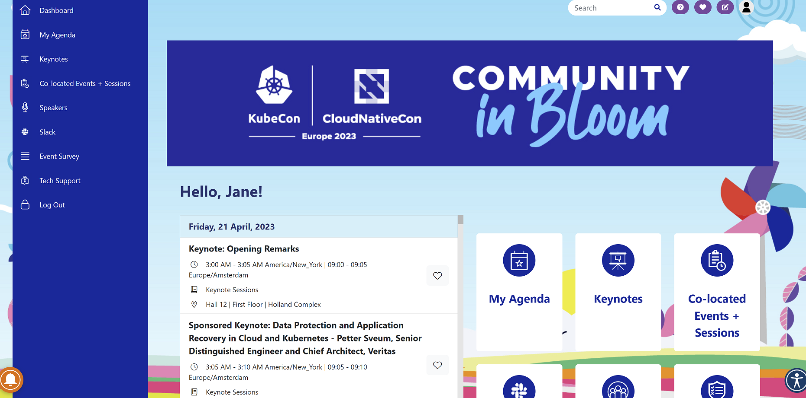

Homepage after:

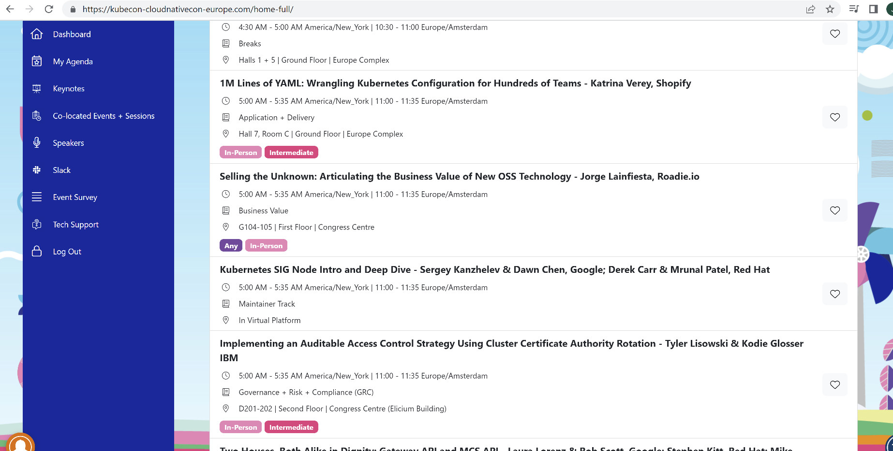

## What I am unhappy about in the initial homepage 

- tini-tiny table with talks list
- lots of useless elements that occupy screen space
- scroll-in-a-scroll
- there isn't even a separate page with *only* schedule

Sched is not cutting it for me - there's no video of the talk in there, not even a link to videostream.
I just need a long list of talk videos...

## How to add JS to make homepage pretty

### Option 1, with autoloading of the script that adjusts KubeCon homepage. Using Tampermonkey or similar Chrome plugin.

Chrome, 112.0 version

1. Install [Tampermonkey plugin](https://chrome.google.com/webstore/detail/tampermonkey/dhdgffkkebhmkfjojejmpbldmpobfkfo) into Chrome
2. pin Tampermonkey plugin in browser header

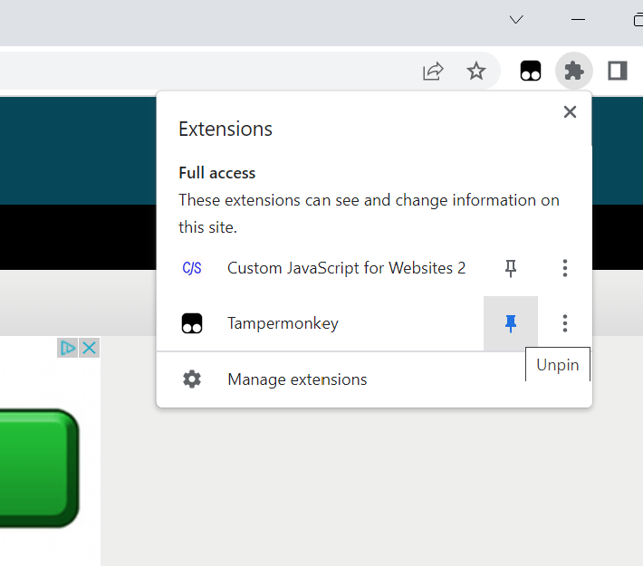

3. Click Tampermonkey plugin icon in browser header, select "Create a new script..."

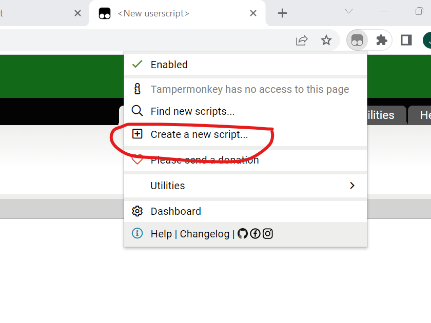

4. add [fix-homepage.js](fix-homepage.js) file contents to the script body. Can examine the JS - nothing fancy in there, find element-set style.

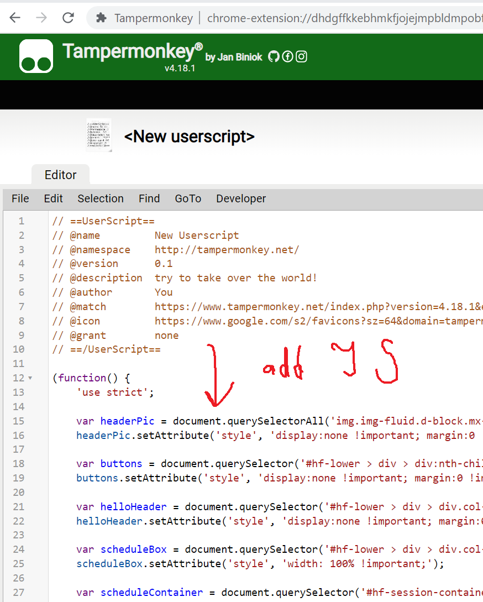

5. Select tab "Settings" right above script edit area. Section "Includes/Excludes", "User matches" box, click "Add..." button - put https://kubecon-cloudnativecon-europe.com/home-full/ in the pop-up window

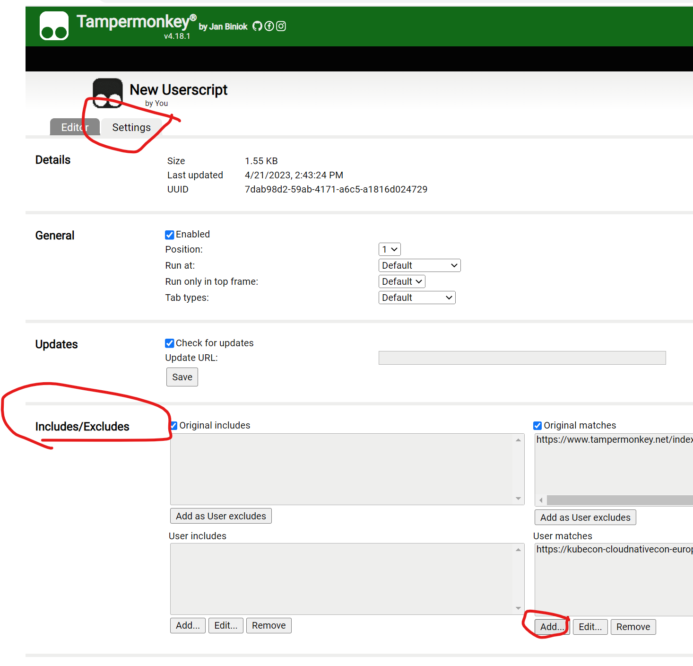

6. !! Click "Save" !!

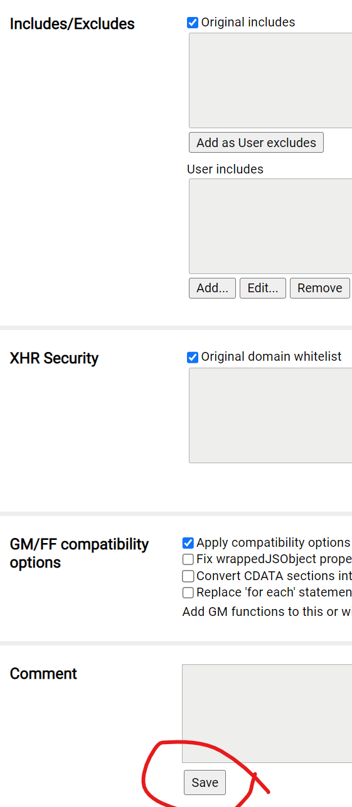

7. Reload KubeCon homepage

8. It should autoload the script every time kubecon homepage loads

### Option 2. Use content snippets. No plugins. No autoload.

Chrome browser

1. Load webpage https://kubecon-cloudnativecon-europe.com/home-full/ , right click on page content, click "Inspect"
2. In developer tools panel, select "Sources" tab, in that select "Snippets" tab
3. Click "+ New snippet"

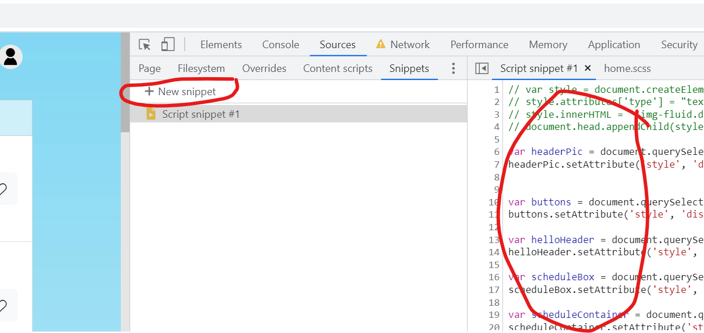

4. Put contents of [fix-homepage.js](fix-homepage.js) file into the snippet body window. Save snippet (Ctrl+S).

5. Run snippet - click on run button

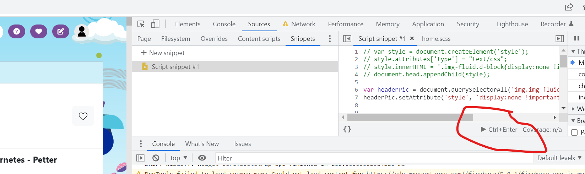

6. You don't have to create snippet each time, but you have to run it each time

## Manual (artistic) process of fixing the homepage

1. Delete the buttons on the right to the schedule. Who needs these buttons here?! They are also in left-side menu and that's where I would look for them

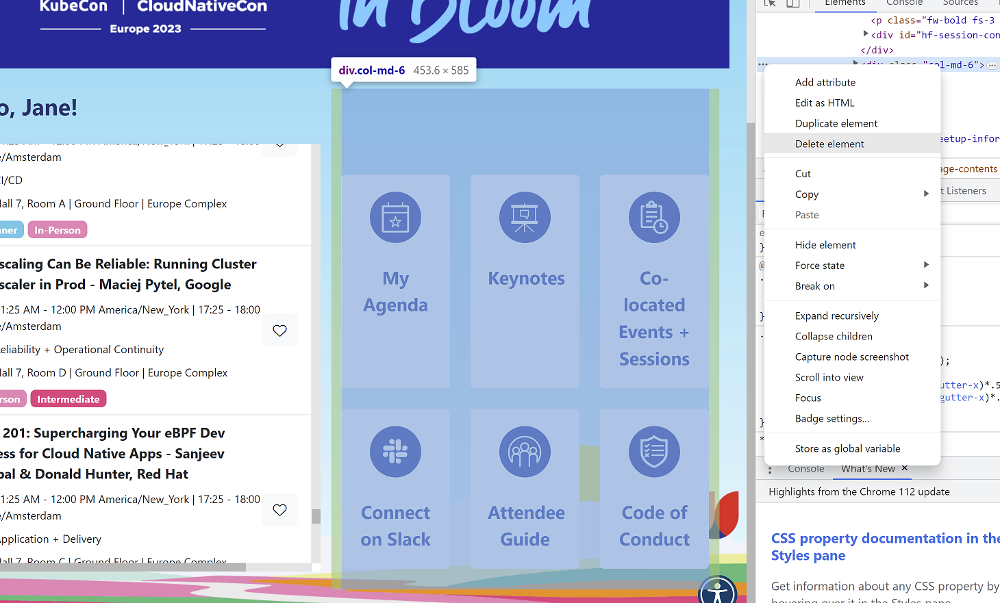

2. Make left column full-width

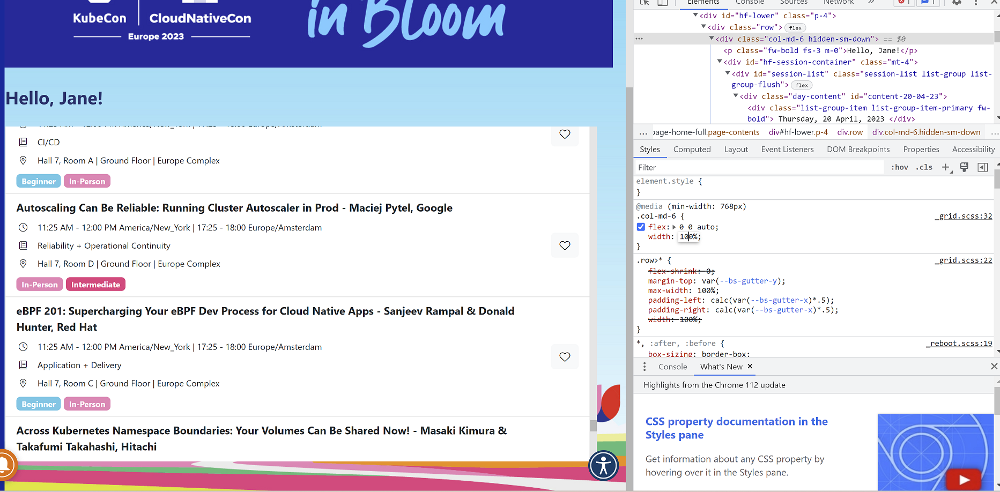

3. Remove the useless "Community in Bloom" header

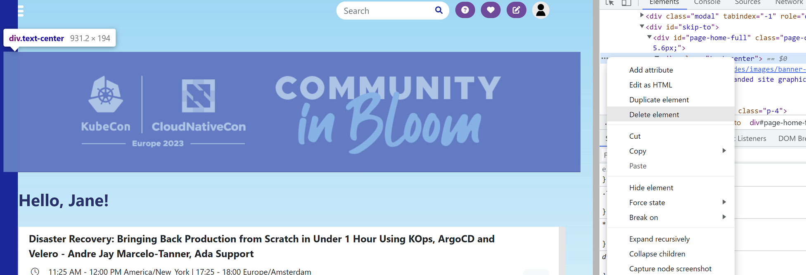

4. Remove equally useless "Hello, Jane" header (seriously? You just put "Hello user" there?! Did you make sysadmin write this website for you?)

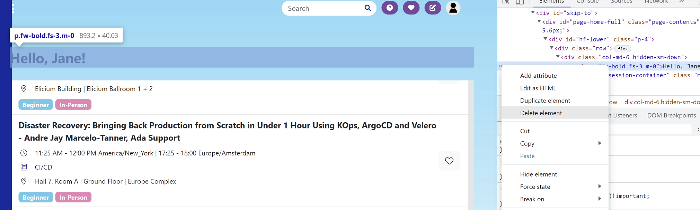

5. Find container with schedule and remove fixed height to get rid of, oh gosh, scroll-in-a-scroll

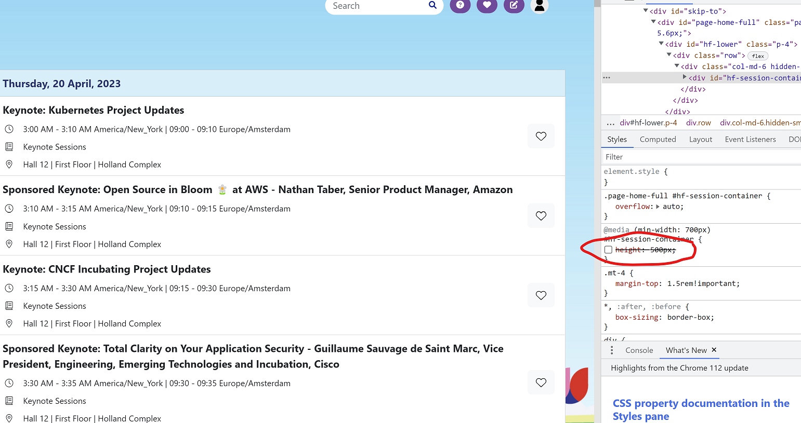

P.S. Are they hiding the schedule at all for mobile devices? LOL
